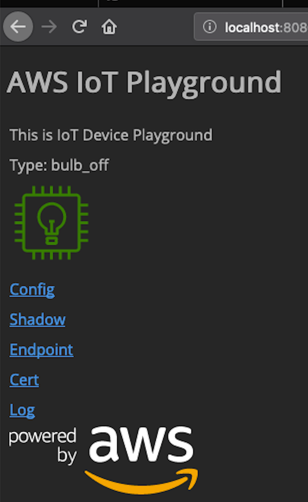
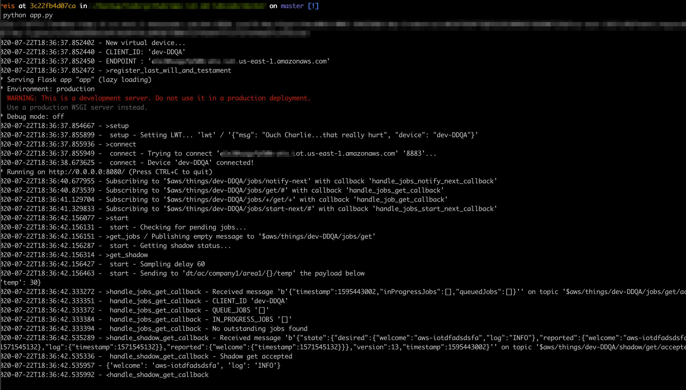
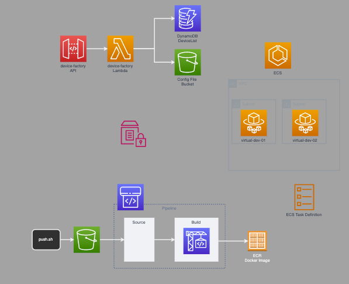

# AWS IoT Playground

A project to play with virtual devices and learn more about AWS IoT features such as device provisioning, device management, and security.





# Install the Required Infrastructure

You need to install the playground using the commands below.

```
make create-cdk-env
make deploy-stack
```



# Provision your First Device

After creating the infrastructure, you don't have a virtual device image on the ECR. So the first, step is to push a default image. This can be easily done with:

```
scripts/push.sh
```

It may take a while (few minutes) to go through the pipeline and create the docker image. You can check the status with

```
while [ 1 ]; do aws ecr list-images --repository-name iot-playground; sleep 5; done;
```

Run the following command to call the device-factory API and provision your first device.

```
./scripts/cp-create-thing.sh
{"dev_name": "dev-QAUE", "endpoint": "XXXXXXXXX-ats.iot.us-east-2.amazonaws.com", "task_arn": "arn:aws:ecs:us-east-2:123456789012:task/15f52c80-33c7-4cf5-ab3d-5da91708fad6", "cluster_arn": "arn:aws:ecs:us-east-2:123456789012:cluster/iot-playground-DeviceCluster8AF64519-Gn0kJDxJZ2RP", "config_file_url": "https://iot-playground-086464235113-us-east-2.s3.amazonaws.com/dev-QAUE.cfg?...", "result": "OK"}
```

# Updating the Virtual Device Image

After creating the infrastructure, you don't have a virtual device image on the ECR. So the first, step is to push a default image. This can be easily done with:

```
scripts/push.sh
```

It may take a while (few minutes) to go through the pipeline and create the docker image. You can check the status with

```
aws ecr list-images --repository-name iot-playground
```

# Scripts

There are different scripts to help doing common operations.
* broker-debug.sh - connects to AWS IoT Broker and listen all messages
* show-exports.sh - display environment variables that may help you run the code on your computer. You need to copy and paste then on the terminal
* push.sh - publish the new virtual device code. Needs to wait to finish the preparation of the new container, later it will be available for provisioning

## Control Plane Operations

* cp-create-thing.sh - create a new device

## Virtual Device Commands

Using the "/config" path send the command. For example, /config?time=1

* time=<int> - change the **delay** between messages
* reconnect <no-args> - force a reconnection 
* clean <no-args> - force a clean disconnect
* topic=<topic> - change the publish topic. Ex: /config?topic=newtopic/dev1

# Structure

* control-plane
* docs
* virtual-device
* lambdas

## Standard Used

Files use - (dash) to separate instead of _ (underline). The exception is for python files that don't play well with - (dash).

## Caveats

You should use the same python version on your computer and docker file (virtual-device/dockerfile) to package the container.

The virtual device runs using supervisord so it can monitor and restart the app if an error occur. In the future, it may allow the inclusion of a OTA update or Device Defender agent.

---

# TODO
- [ ] Command-and-reply pattern
- [ ] Integration with Cognito
- [ ] Control plane with web interface 
- [ ] Rogue device
